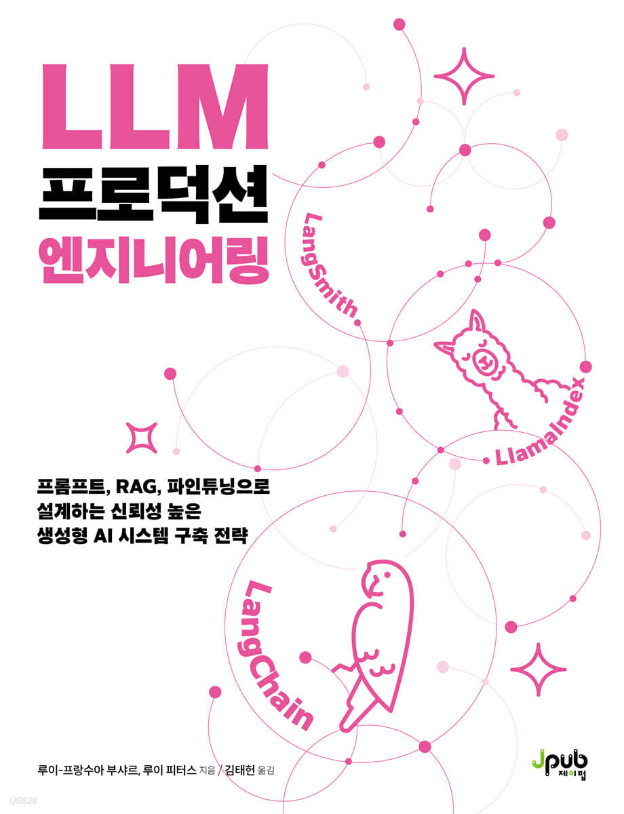
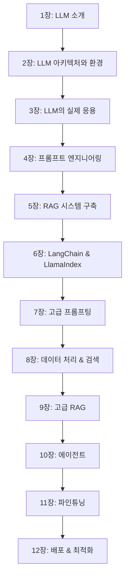

# 📚 LLM 프로덕션 엔지니어링

<div align="center">




**프롬프트, RAG, 파인튜닝으로 설계하는 신뢰성 높은 생성형 AI 시스템 구축 전략**

*Building LLMs for Production의 한국어 번역본*

</div>

---

## 📖 도서 정보

- **원제**: Building LLMs for Production  
- **저자**: 루이-프랑수아 부샤르 (Louis-François Bouchard), 루이 피터스 (Louis Peters)
- **역자**: 김태헌
- **출판사**: 제이펍
- **출간일**: 2025년 09월 11일
- **구매 링크**: 
  - [YES24에서 구매하기](https://www.yes24.com/product/goods/152649470)
  - [교보문고에서 구매하기](https://product.kyobobook.co.kr/detail/S000217428546)

## ⚠️ 이 저장소에 대하여

**이 저장소는 원서의 완전한 예제 코드를 제공하지 않습니다.**

이 저장소의 목적:
- 📝 **업데이트된 코드**: 원서 출간 이후 라이브러리 업데이트로 작동하지 않는 코드의 수정본
- 🇰🇷 **한글 해석**: 한국 독자를 위한 추가 설명과 주석
- 🔧 **실행 환경 개선**: 현재 환경에 맞는 설정 및 설치 가이드

**📖 완전한 원서 예제 코드는 원저자의 공식 자료를 참고하세요:**
- 🎓 **원저자 강의**: [Towards AI Academy](https://academy.towardsai.net/courses/buildingllmsforproduction)
- 📚 **코딩 환경 및 패키지**: [https://towardsai.net/book](https://towardsai.net/book)
- 💬 **학습 리소스**: [Discord 커뮤니티](https://discord.com/invite/learnaitogether)

## 🎯 이 책에서 다루는 내용

### 📚 주요 챕터
1. **LLM 소개** - 언어 모델의 역사와 기본 개념
2. **LLM 아키텍처와 환경** - 트랜스포머와 GPT 아키텍처
3. **LLM의 실제 응용** - 환각과 편향 문제 해결
4. **프롬프트 엔지니어링 소개** - 효과적인 프롬프팅 기법
5. **RAG** - 검색 증강 생성 시스템 구축
6. **LangChain 및 LlamaIndex 소개** - LLM 프레임워크 활용
7. **LangChain을 사용한 프롬프트 작성** - 고급 프롬프팅
8. **인덱스, 검색기, 그리고 데이터 준비** - 데이터 처리 파이프라인
9. **고급 RAG** - 실제 제품 수준의 RAG 시스템
10. **에이전트** - 추론 엔진으로서의 LLM 활용
11. **파인튜닝** - LoRA, SFT, RLHF를 통한 모델 최적화
12. **배포 및 최적화** - 모델 증류, 양자화, 클라우드 배포

## 🚀 실습 환경 설정

### 필수 요구사항
이 책의 코딩 환경을 따라하려면 적절한 코딩 환경을 준비해야 합니다.

**파이썬 버전**: 3.8 이상 사용해야 합니다.

**컴퓨터 코드 편집기를 실행합니다**: 비주얼 스튜디오 코드(Visual Studio Code), VS Code는 파이썬 가상 환경을 사용하여 파이썬 라이브러리를 관리하는 인기 있는 코딩 환경입니다.

**구글 코랩 노트북을 사용합니다**.

### 환경 변수 설정
```bash
# .env 파일 생성
OPENAI_API_KEY=your_openai_api_key
HUGGINGFACE_API_TOKEN=your_hf_token
```

### 학습 리소스
학습 과정을 통기 위해 필요한 경우 사용할 수 있는 오픈소스 AI 튜터 챗봇을 공유합니다. 이 모든 것은 이 책에서 가르치는 동일한 도구를 사용하여 만들어졌습니다.

- **LLM에 최신 문서에 접근할 수 있는 RAG 시스템들**: 구축목표, LangChain 및 LlamaIndex의 문서와 이전 공개한 모든 교육 포함됩니다.
- **AI 학습 중 초보자든 전문가든 질문과 도움을 받을 수 있는** Learn AI Together Discord 커뮤니티의 구성원 및 협자들에게 연락할 수 있습니다.

**전체 리소스**: [https://towardsai.net/book](https://towardsai.net/book)

## 📁 저장소 구조

```
build_LLM_for_production/
├── 📂 ch01-llm-introduction/     # 1장: LLM 소개
├── 📂 ch02-llm-architecture/     # 2장: LLM 아키텍처와 환경
├── 📂 ch03-llm-applications/     # 3장: LLM의 실제 응용
├── 📂 ch04-prompt-engineering/   # 4장: 프롬프트 엔지니어링 소개
├── 📂 ch05-rag/                  # 5장: RAG
├── 📂 ch06-langchain-llamaindex/ # 6장: LangChain 및 LlamaIndex 소개
├── 📂 ch07-langchain-prompts/    # 7장: LangChain을 사용한 프롬프트 작성
├── 📂 ch08-indexing-retrieval/   # 8장: 인덱스, 검색기, 그리고 데이터 준비
├── 📂 ch09-advanced-rag/         # 9장: 고급 RAG
├── 📂 ch10-agents/               # 10장: 에이전트
├── 📂 ch11-fine-tuning/          # 11장: 파인튜닝
├── 📂 ch12-deployment/           # 12장: 배포 및 최적화
├── 📂 notebooks/                 # 실습용 Jupyter 노트북
├── 📂 datasets/                  # 실습용 데이터셋
├── 📂 utils/                     # 유틸리티 함수
├── requirements.txt              # 패키지 의존성
├── setup.py                      # 설치 스크립트
└── README.md                     # 이 문서
```

## 💡 주요 실습 프로젝트

### ✨ 5장: RAG
- 밑바닥부터 시작하는 기본 RAG 파이프라인 구축

### 🛠 8장: 인덱스, 검색기, 그리고 데이터 준비
- 고객 지원 Q&A 챗봇
- Whisper와 LangChain을 이용한 유튜브 비디오 요약기
- 지식 베이스를 위한 음성 비서
- 자기 비판 체인을 사용한 원치 않는 출력 방지

### 📊 10장: 에이전트
- 분석 보고서 작성 에이전트 구축
- LlamaIndex를 사용한 데이터베이스 쿼리 및 요약
- OpenAI 어시스턴트를 활용한 에이전트 구축
- 멀티모달 금융 문서 분석기로 PDF 파일 분석하기

### 🎯 11장: 파인튜닝
- LoRA를 활용한 SFT
- SFT 및 LoRA를 활용한 금융 감정 분석
- 의료 데이터를 활용한 Cohere LLM 파인튜닝
- RLHF를 통한 LLM 성능 향상

## 🎓 학습 로드맵



## 📝 실습 예제

### 간단한 RAG 시스템 구현
```python
from langchain.document_loaders import TextLoader
from langchain.text_splitter import CharacterTextSplitter
from langchain.embeddings import OpenAIEmbeddings
from langchain.vectorstores import Chroma

# 문서 로딩 및 분할
loader = TextLoader("document.txt")
documents = loader.load()
text_splitter = CharacterTextSplitter(chunk_size=1000, chunk_overlap=0)
texts = text_splitter.split_documents(documents)

# 벡터 스토어 생성
embeddings = OpenAIEmbeddings()
vectorstore = Chroma.from_documents(texts, embeddings)

# 검색 기반 QA 시스템
retriever = vectorstore.as_retriever()
```

## 🤝 기여하기

이 저장소는 "LLM 프로덕션 엔지니어링" 한국어 번역본의 **보완 자료**를 제공하는 공간입니다.

### 🎯 기여 대상
- **업데이트된 코드**: 라이브러리 버전 변경으로 작동하지 않는 예제 수정
- **한글 주석**: 한국 독자를 위한 상세한 코드 설명 추가
- **환경 설정 가이드**: 현재 환경에 맞는 설치 및 실행 방법
- **오류 수정**: 오타나 코드 버그 발견 시 수정

### 기여 방법
1. **이슈 등록**: 작동하지 않는 코드나 개선사항 제안
2. **풀 리퀘스트**: 수정된 코드나 새로운 해석 추가
3. **토론**: 구현 방법이나 한국어 설명 개선 방안 공유

### 기여 가이드라인
- 원서의 **완전한 복제보다는 보완과 개선**에 중점
- 코드는 **Python PEP 8** 스타일 가이드 준수
- **한글 주석과 설명** 적극 추가
- 가능한 경우 **현재 라이브러리 버전**에 맞게 최적화

## 📞 문의 및 지원

### 🔗 원저자 리소스
- **📖 원저자 코드 및 패키지**: [https://towardsai.net/book](https://towardsai.net/book)
- **🎓 원저자 온라인 강의**: [Towards AI Academy](https://academy.towardsai.net/courses/buildingllmsforproduction)
- **💬 Discord 학습 커뮤니티**: [Learn AI Together](https://discord.com/invite/learnaitogether)

### 번역서 관련 문의
- **번역자**: 김태헌
- **GitHub**: [@datakim](https://github.com/datakim)
- **출판사**: 제이펍

### 질문과 토론
- **Issues**: 코드 버그나 업데이트 요청
- **Discussions**: 일반적인 질문이나 학습 관련 토론
- **Pull Requests**: 코드 개선이나 한글 해석 기여

## 📄 라이선스

이 저장소의 코드는 [MIT License](LICENSE)를 따릅니다.

책의 내용에 대한 저작권은 원저자와 제이펍 출판사에 있습니다.

---

<div align="center">

### 🌟 도움이 되셨다면 ⭐ 스타를 눌러주세요!

**LLM 프로덕션 엔지니어링으로 생성형 AI의 실무 역량을 키워보세요**

[](https://www.yes24.com/product/goods/152649470)
[](https://product.kyobobook.co.kr/detail/S000217428546)

</div>
